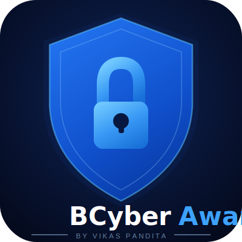

  

<h1 align="center">Vikas Pandita — Portfolio</h1>

  <strong>Cybersecurity Expert &amp; Developer</strong> 
  <em>Creator of BCyberAware</em>

  
  
  

---

## About

This is the personal portfolio and GitHub Pages site of **Vikas Pandita** — cybersecurity professional and creator of the [BCyberAware](https://github.com/vikaspandita12/bcyberaware) threat intelligence platform.

## Projects

- **BCyberAware** — AI-powered Threat Intelligence Dashboard
- **ThreatForge** — SAR Automation Platform

---

  Built with passion by <strong>Vikas Pandita</strong>

